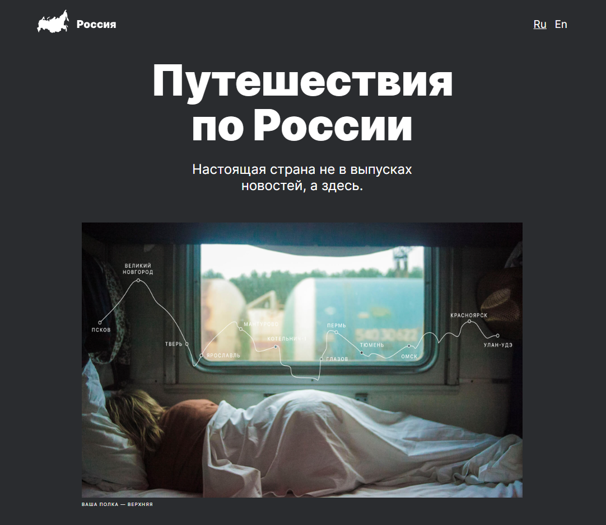

# Проект: Путешествие по России

## О проекте:
Одностраничный сайт, на котором пользователь может ознакомиться с интересными и красивыми местами в России.
В проекте содержаться ссылки на другие сайты, в которых можно получить более подробную информацию о рассказанных местах.

### Функционал:
- Сайт адаптирован под разные устройства
### Стек технологий:
- HTML5;
  - Семантические теги
- CSS3:
  - Flexbox;
  - Grid Layout;
  - Media Queries;
  - Positioning;
  - Adaptive UI;
  - Pseudo-classes
- Методология БЭМ;
- Фйловая структура Nested БЭМ;
- Весь текст редактировался при помощи "Типографа"
- Вёрстка по макету в [Figma.](https://www.figma.com/file/5S2WSbEFL6awjVWJ0NWL8Q/Sprint-3_-Russia-_-desktop-%2B-mobile?node-id=28503%3A0&t=Oj1uKakxhSp501kR-0)

[Ссылка на проект Github Pages](https://natalymaxi.github.io/russian-travel/index.html)
